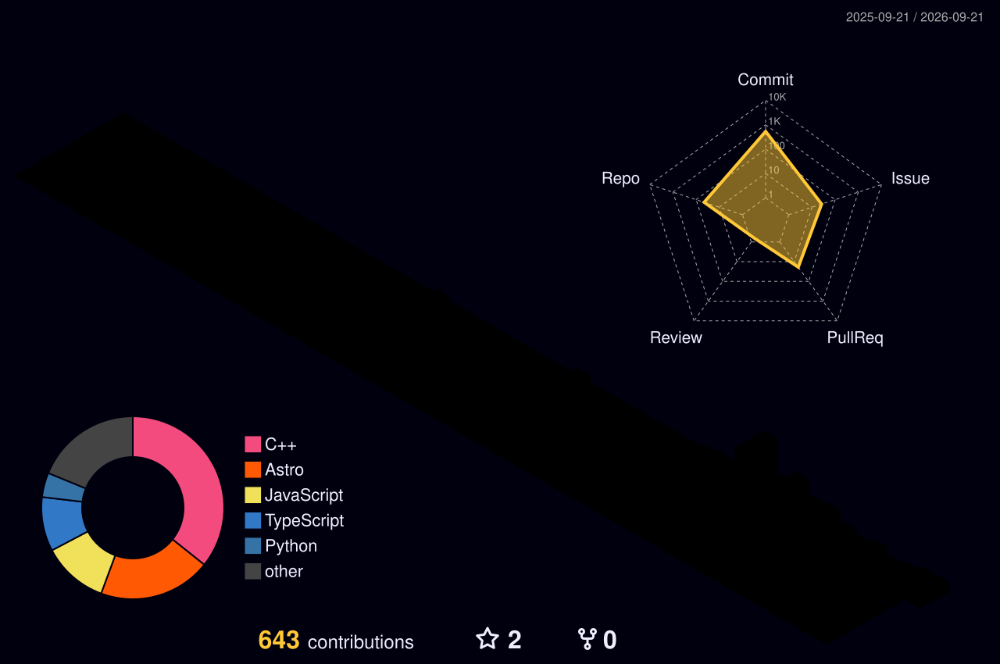

 

&nbsp;

&nbsp;

---

## 🧑‍💻 &nbsp;About Me

Hey! I'm **Mohiuddin** — a passionate developer from 🇮🇳 India who loves turning ambitious ideas into real, working products.

I specialize in **Full Stack Development** and **AI-powered applications**, with a strong eye for performance, clean code, and seamless user experiences.

 

🔭 &nbsp;**Currently building** → AI-powered apps & scalable backends  
🌱 &nbsp;**Learning** → Machine Learning · LLMs · Cloud Architecture  
💡 &nbsp;**Philosophy** → *"Ship fast, iterate faster."*  
⚡ &nbsp;**Fun fact** → I debug with `print()` first, then StackOverflow 😄  

 

📫 &nbsp;[nizamuddinnumaan8@gmail.com](mailto:nizamuddinnumaan8@gmail.com)  
🌐 &nbsp;[mohiuddin18.vercel.app](https://mohiuddin18.vercel.app)

 

&nbsp;
&nbsp;

 

---

## 🛠 &nbsp;Tech Stack

### 💻 Languages

### ⚙️ Frameworks & Libraries

### ☁️ Cloud, Databases & DevOps

### 🔧 Tools

---

## 🔥 &nbsp;Streak Stats

  

---

## 📊 &nbsp;3D Contribution Graph

  

> ⚡ Auto-updated every night at midnight IST via GitHub Actions

---

## ⚡ &nbsp;GitHub Stats & Activity

  

---

## 🏆 &nbsp;Trophies

  

---

## 🐍 &nbsp;Watch My Contributions Get Eaten

  <picture>
    <source media="(prefers-color-scheme: dark)" srcset="https://raw.githubusercontent.com/mohi2006august/mohi2006august/output/github-snake-dark.svg"/>
    <source media="(prefers-color-scheme: light)" srcset="https://raw.githubusercontent.com/mohi2006august/mohi2006august/output/github-snake.svg"/>
    
  </picture>

---

## 📌 &nbsp;Featured Projects

---

  

**Thanks for visiting! If you like what you see, don't forget to ⭐ a repo.**

`{ dream: big, code: clean, ship: fast }`

 

